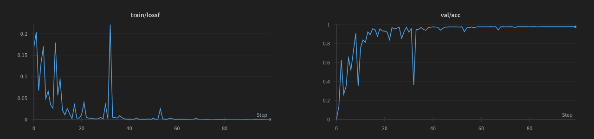

# microTransformer


# Index

1. [Project Overview](#project-overview)
2. [Installation](#installation)
3. [Data Preparation](#data-preparation)
4. [Training](#training)
5. [Sampling](#sampling)
6. [Credits](#credits)

## Project Overview

A simple Transformer implementantion for training and evaluating a
Transformer model. The model can be trained on a single consumer GPU in 
a few hours. The repository is structured as follows:

```
├── config.py <- Transformer configuration and vocabulary
|
├── model.py <- Transformer model, sampling and evaluation <300 lines
|
├── train.py <- training the model ~150 lines
|
├── sample.py <- sampling a trained model
│
├── get_data.py <- generates the validation and test data in csv
│
├── data.py <- loading the data and creating batches
│
└── utils.py <- data sentence generation, tokenization and detokenization
```

microTransformer is based on the raw implementation of the Transformer model, with the encoder and decoder parts. The task we will be working on is the sorting of a sequence of characters. For example, the sequence "ABCB" will be sorted as "ABBC". The vocabulary and the sentence length can be changed in the `config.py` file. You can caculate the number of possible sequences with `calculate_total_possibilities` from `utils.py`.

During the training you will see how the model converges: the loss will decrease and the accuracy will increase.



## Installation

```bash
pip install pandas torch transformers wandb
```

Dependencies:
- [pandas](https://pandas.pydata.org/): Loading and storing the data
- [pytorch](https://pytorch.org/): Define the Transformer model
- [transformers](https://huggingface.co/transformers/): Cosine lr scheduler
- [wandb](https://wandb.ai/): Logging the training process


## Data preparation

The first step is to generate the validation and test data. The training data will be generated on the fly during the training. We need to generate the validation and test data before the training because we will be checking that the training data generated on the fly is not in the validation or test data. 

```bash
python get_data.py
```

## Training

The training can be started with the following command:

```bash
python train.py
```

This will start the training with the default parameters. You can change the parameters in the `config.py` file and the `train.py` file. The training will be logged on [wandb](https://wandb.ai/). At the end of the training, the model will be saved in a `checkpoints` folder.

## Sampling

Once the model is trained, you can test it on your own sentences! We will evaluate with the sorted command from Python if the model is able to sort the sentence correctly. To sample a sentence, you can use the following command:

```bash
python sample.py --model_path <model_checkpoint> --sentence <your_sentence>
```

For example:

```bash
python sample.py --model_path checkpoints/epoch_10.pt --sentence "ABABBBB"
```

Will output:

```text
Input: ABABBBB
Output: AABBBBB (correct)
```

## Credits

- Thanks to [Andrej Karpathy](https://github.com/karpathy) and its [nanoGPT](https://github.com/karpathy/nanoGPT) for clarifying the Transformer model.
- My [blog post](https://aidventure.es/blog/transformer/) on the Transformer model. 
